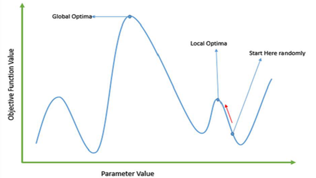

*[Class Scheduler using Genetic Algorithm]{.underline}*

**[1. Introduction]{.underline}**

Genetic algorithm is one of the most important tool for making computer
evolve to solve a specific type of problems.

One of the major application of GA is found in scheduling
events/class/meetings. Class scheduling is a classic NP complete problem
which can be easily solved by using Genetic Algorithm. It is a variation
of constraint satisfaction problem. In which a set of variables is
assigned in such a way that they avoid some constraints or follow some
rules.

The constraint can be for following two types:

**i) Hard Constraint**- these are important requirements which need to
be fulfilled always.

**ii) Soft Constraint**- these constraints are desirable but only after
hard constraints are fulfilled.

Like, for class scheduling, hard constraint can be that at a given time
a professor cannot be in different class rooms, class rooms should have
enough space to host a given class etc.

Soft constraints can be preferred time slot for professors to take class
or preferred class room of a professor.

**[
]{.underline}**

**[2. Problem Statement]{.underline}**

The class scheduling problem that we will be solving is equivalent to a
college class scheduler which will make a schedule based on available
information like professors available, rooms, time slots and student
groups.

As this is a typical college class schedule, students can have free
periods depending on the modules they have enrolled in.

In the schedule, each class will have a professor, a timeslot, a room
and group of students enrolled in that class.

**Total number of classes = (Sum of total number of student groups) \*
(Number of modules of each student group)**

We will be using following hard constraint for developing our class
scheduling application:

-   Classes can only be scheduled in free classrooms

-   A professor can only teach one class at any one time

-   Classrooms must be big enough to accommodate the student group

***[Note:]{.underline}** To optimize my solution I have used **Parallel
Processing** to calculate fitness functions and used **Hash Table** to
store the values of fitness function to improve the running time of my
application.*
